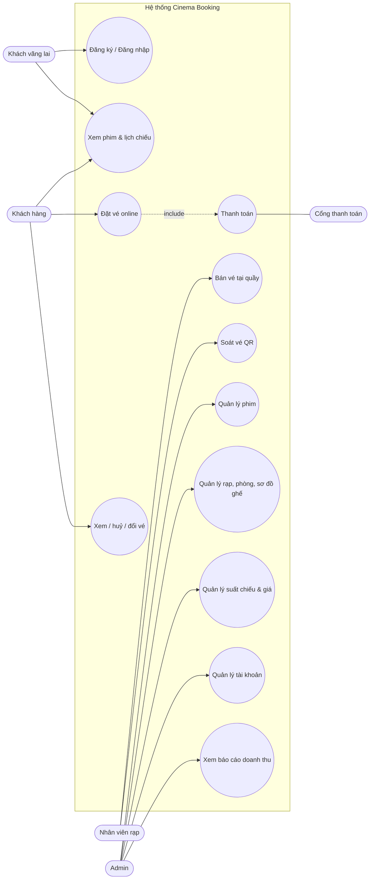

# 2. Use case

## 2.1 Sơ đồ use case

## 2.2 Đặc tả các use case chính

### UC3 – Đặt vé online

| Mục | Nội dung |
|---|---|
| Tác nhân | Khách hàng |
| Tiền điều kiện | Đã đăng nhập; suất chiếu ở trạng thái `scheduled` và chưa bắt đầu |
| Hậu điều kiện | Đơn ở trạng thái `confirmed`, ghế `sold`, khách nhận vé QR qua email |

**Luồng chính**
1. Khách chọn phim, rạp, ngày, rồi chọn suất.
2. Hệ thống hiển thị sơ đồ ghế kèm trạng thái và giá từng ghế.
3. Khách chọn 1–8 ghế và bấm "Tiếp tục".
4. Hệ thống giữ các ghế đã chọn trong 10 phút, tạo đơn `pending` và hiển thị đồng hồ đếm ngược.
5. Khách thêm combo hoặc mã giảm giá (tuỳ chọn), rồi bấm "Thanh toán" (thực hiện UC4).
6. Cổng thanh toán báo thành công. Hệ thống xác nhận đơn, sinh vé và hoá đơn, gửi email.

**Luồng ngoại lệ**
- 4a. Có ghế vừa bị người khác giữ: hệ thống trả 409 và không giữ ghế nào; khách chọn lại.
- 4b. Khách gửi quá 10 yêu cầu giữ ghế trong một phút: hệ thống trả 429.
- 5a. Hết 10 phút mà chưa thanh toán: ghế được nhả, đơn chuyển `expired`.
- 6a. Thanh toán thất bại: đơn vẫn `pending` cho tới khi hết hạn; khách có thể thử lại.
- 6b. Cổng báo thành công nhưng thời gian giữ ghế đã hết: hệ thống tự hoàn tiền và báo khách.

### UC5 – Huỷ / đổi vé

| Mục | Nội dung |
|---|---|
| Tác nhân | Khách hàng |
| Tiền điều kiện | Vé ở trạng thái `valid`, suất chưa bắt đầu |

**Luồng chính (huỷ)**
1. Khách mở "Vé của tôi" và chọn vé.
2. Hệ thống tính số tiền được hoàn theo chính sách (100% / 70% / 0%) và hiển thị.
3. Khách xác nhận. Hệ thống chuyển vé sang `refunded`, nhả ghế, tạo giao dịch hoàn tiền và gửi email.

**Luồng thay thế (đổi vé)**
- 1a. Khách chọn "Đổi suất", chọn suất mới của cùng phim và chọn ghế.
- 2a. Hệ thống giữ ghế mới rồi tính chênh lệch; khách thanh toán phần chênh lệch nếu có.
- 3a. Trong một transaction: vé cũ chuyển `cancelled`, ghế cũ được nhả, vé mới được sinh.

**Ngoại lệ:** còn dưới 2 giờ trước giờ chiếu, hoặc vé đã đổi một lần: hệ thống từ chối đổi.

### UC7 – Soát vé QR

| Mục | Nội dung |
|---|---|
| Tác nhân | Nhân viên rạp |
| Tiền điều kiện | Nhân viên đã đăng nhập và được gán rạp |

**Luồng chính**
1. Nhân viên quét QR bằng camera hoặc nhập mã vé.
2. Hệ thống kiểm tra chữ ký, vé `valid`, đúng rạp, và thời điểm quét nằm trong khoảng từ 30 phút trước đến 15 phút sau giờ chiếu.
3. Hệ thống chuyển vé sang `used` và hiển thị phim, phòng, ghế màu xanh.

**Ngoại lệ:** vé đã dùng (hiện thời điểm check-in trước đó), vé đã huỷ, sai rạp, sai giờ, QR giả: hệ thống hiện màu đỏ kèm lý do.

### UC6 – Bán vé tại quầy
Luồng giống UC3, với các khác biệt: nhân viên thao tác thay khách; chỉ thấy suất của rạp mình; thanh toán tiền mặt được xác nhận ngay; vé được in ra (PDF khổ 80 mm). Có thể nhập email hoặc số điện thoại khách để tích điểm.

### UC10 – Quản lý suất chiếu

| Mục | Nội dung |
|---|---|
| Tác nhân | Admin |

**Luồng chính**
1. Admin chọn phim, phòng, giờ bắt đầu, định dạng, giá gốc.
2. Hệ thống tính giờ kết thúc và kiểm tra trùng phòng (tính cả thời gian dọn phòng).
3. Hệ thống tạo suất và sinh `showtime_seats` cho mọi ghế đang hoạt động, với giá tính theo bảng giá.

**Ngoại lệ:** trùng phòng thì trả 409 kèm tên suất bị trùng. Không được sửa phòng hoặc giờ của suất đã bán vé; chỉ được huỷ suất (hệ thống tự hoàn tiền).

### UC11 – Quản lý tài khoản (đã triển khai – tuần 1)
1. Admin tìm tài khoản theo email hoặc tên, lọc theo vai trò, phân trang.
2. Admin tạo tài khoản nhân viên (bắt buộc chọn rạp) hoặc tài khoản admin.
3. Admin sửa họ tên, số điện thoại, vai trò, rạp, trạng thái khoá. Khi đổi vai trò hoặc khoá, người dùng bị đăng xuất ngay.

**Ngoại lệ:** email trùng (409); dữ liệu đã bị người khác sửa trước (409 `VERSION_CONFLICT`, hệ thống tải lại); admin tự khoá mình (400).
