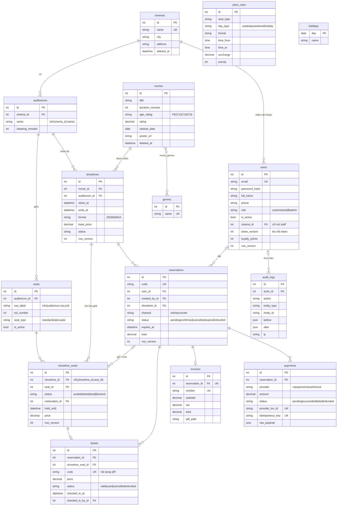

# 3. ERD

Sơ đồ khớp với các model trong `backend/app/models/` và migration `backend/alembic/versions/*_0001_initial_schema.py`.
Các cột `created_at`, `updated_at` có ở hầu hết bảng nên được lược bớt khỏi sơ đồ.

## Ghi chú thiết kế

- **`showtime_seats` là trung tâm của việc chống đặt trùng.** Mỗi suất sinh sẵn một dòng cho mỗi ghế. Giữ ghế là câu `UPDATE ... WHERE status='available' OR (status='held' AND held_until < now())`, nên hai người không thể cùng giữ một ghế. Ràng buộc UNIQUE(showtime_id, seat_id) đảm bảo không có hai dòng cho cùng một ghế.
- **Giá được chốt** vào `showtime_seats.price` và `tickets.price`, nên sửa bảng giá sau đó không làm sai doanh thu cũ.
- **`reservations.user_id` có thể null**: dùng cho khách mua tại quầy mà không có tài khoản.
- **`token_version`**: tăng lên thì mọi JWT đã phát cho tài khoản đó (access, refresh, reset) đều mất hiệu lực.
- **`row_version`**: SQLAlchemy tự tăng mỗi lần UPDATE; dùng để phát hiện hai người sửa cùng lúc.
- **Enum lưu dạng VARCHAR** để thêm giá trị mới mà không cần `ALTER TYPE`, và chạy được trên cả SQLite lẫn Postgres.
