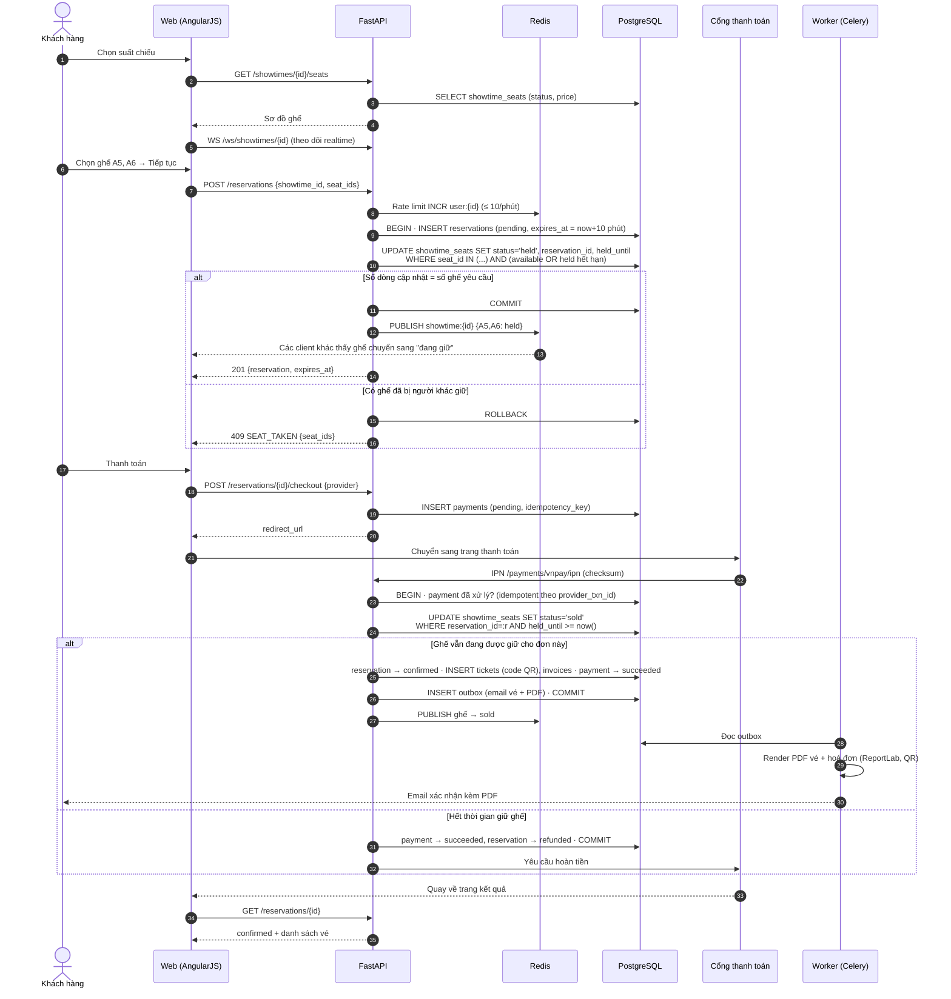
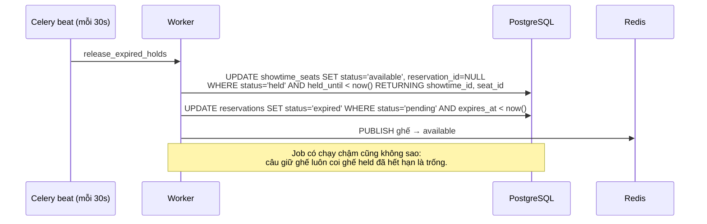
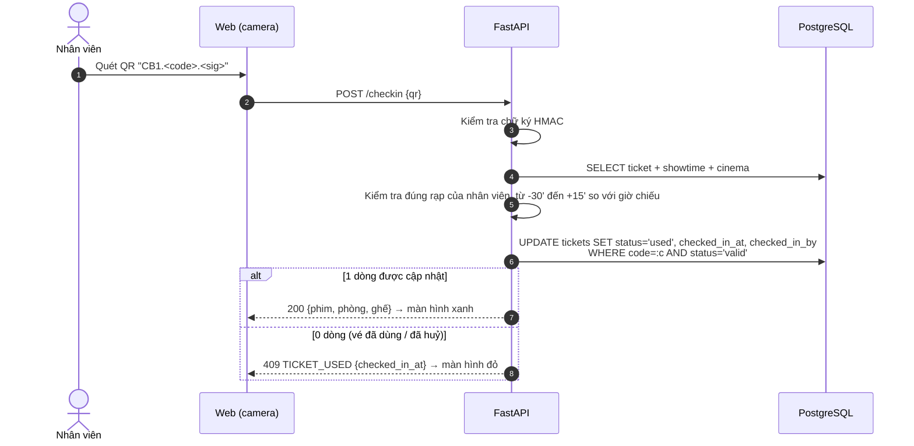

# 4. Sequence diagram – Luồng đặt vé đến check-in

## 4.1 Giữ ghế và thanh toán online

```mermaid
sequenceDiagram
  autonumber
  actor KH as Khách hàng
  participant UI as Web (AngularJS)
  participant API as FastAPI
  participant R as Redis
  participant DB as PostgreSQL
  participant PG as Cổng thanh toán
  participant W as Worker (Celery)

  KH->>UI: Chọn suất chiếu
  UI->>API: GET /showtimes/{id}/seats
  API->>DB: SELECT showtime_seats (status, price)
  API-->>UI: Sơ đồ ghế
  UI->>API: WS /ws/showtimes/{id} (theo dõi realtime)

  KH->>UI: Chọn ghế A5, A6 → Tiếp tục
  UI->>API: POST /reservations {showtime_id, seat_ids}
  API->>R: Rate limit INCR user:{id} (≤ 10/phút)
  API->>DB: BEGIN · INSERT reservations (pending, expires_at = now+10 phút)
  API->>DB: UPDATE showtime_seats SET status='held', reservation_id, held_until<br/>WHERE seat_id IN (...) AND (available OR held hết hạn)
  alt Số dòng cập nhật = số ghế yêu cầu
    API->>DB: COMMIT
    API->>R: PUBLISH showtime:{id} {A5,A6: held}
    R-->>UI: Các client khác thấy ghế chuyển sang "đang giữ"
    API-->>UI: 201 {reservation, expires_at}
  else Có ghế đã bị người khác giữ
    API->>DB: ROLLBACK
    API-->>UI: 409 SEAT_TAKEN {seat_ids}
  end

  KH->>UI: Thanh toán
  UI->>API: POST /reservations/{id}/checkout {provider}
  API->>DB: INSERT payments (pending, idempotency_key)
  API-->>UI: redirect_url
  UI->>PG: Chuyển sang trang thanh toán
  PG->>API: IPN /payments/vnpay/ipn (checksum)
  API->>DB: BEGIN · payment đã xử lý? (idempotent theo provider_txn_id)
  API->>DB: UPDATE showtime_seats SET status='sold'<br/>WHERE reservation_id=:r AND held_until >= now()
  alt Ghế vẫn đang được giữ cho đơn này
    API->>DB: reservation → confirmed · INSERT tickets (code QR), invoices · payment → succeeded
    API->>DB: INSERT outbox (email vé + PDF) · COMMIT
    API->>R: PUBLISH ghế → sold
    W->>DB: Đọc outbox
    W->>W: Render PDF vé + hoá đơn (ReportLab, QR)
    W-->>KH: Email xác nhận kèm PDF
  else Hết thời gian giữ ghế
    API->>DB: payment → succeeded, reservation → refunded · COMMIT
    API->>PG: Yêu cầu hoàn tiền
  end
  PG-->>UI: Quay về trang kết quả
  UI->>API: GET /reservations/{id}
  API-->>UI: confirmed + danh sách vé
```

## 4.2 Nhả ghế hết hạn

```mermaid
sequenceDiagram
  participant B as Celery beat (mỗi 30s)
  participant W as Worker
  participant DB as PostgreSQL
  participant R as Redis

  B->>W: release_expired_holds
  W->>DB: UPDATE showtime_seats SET status='available', reservation_id=NULL<br/>WHERE status='held' AND held_until < now() RETURNING showtime_id, seat_id
  W->>DB: UPDATE reservations SET status='expired' WHERE status='pending' AND expires_at < now()
  W->>R: PUBLISH ghế → available
  Note over W,DB: Job có chạy chậm cũng không sao:<br/>câu giữ ghế luôn coi ghế held đã hết hạn là trống.
```

## 4.3 Check-in tại cửa phòng chiếu

```mermaid
sequenceDiagram
  autonumber
  actor NV as Nhân viên
  participant UI as Web (camera)
  participant API as FastAPI
  participant DB as PostgreSQL

  NV->>UI: Quét QR "CB1.<code>.<sig>"
  UI->>API: POST /checkin {qr}
  API->>API: Kiểm tra chữ ký HMAC
  API->>DB: SELECT ticket + showtime + cinema
  API->>API: Kiểm tra đúng rạp của nhân viên, từ -30' đến +15' so với giờ chiếu
  API->>DB: UPDATE tickets SET status='used', checked_in_at, checked_in_by<br/>WHERE code=:c AND status='valid'
  alt 1 dòng được cập nhật
    API-->>UI: 200 {phim, phòng, ghế} → màn hình xanh
  else 0 dòng (vé đã dùng / đã huỷ)
    API-->>UI: 409 TICKET_USED {checked_in_at} → màn hình đỏ
  end
```
